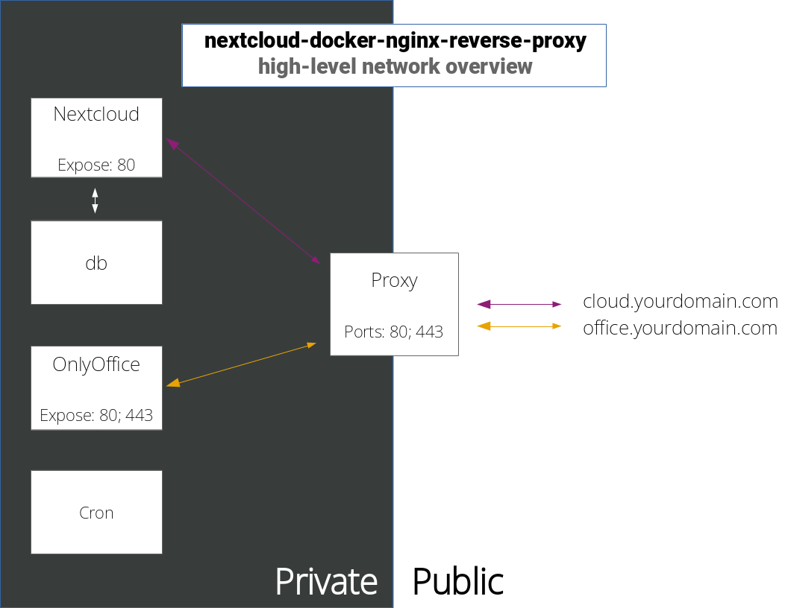

# nextcloud-docker-nginx-reverse-proxy
A Docker based Nextcloud stack.  

## Features
- HTTPS enforced / only
- Only ports exposed are from the nginx / LetsEncrypt webserver (443 and 80)
- Seperated office and cloud subdomains for security
- OnlyOffice integration (can be swapped out for CollaboraOnline)

## Overview
<a href="./high-level-overview.svg">
    
</a>

## Containers
- Nextcloud
- MariaDB / db
- OnlyOffice (or [CollaboraOnline](#using-collaboraonline-instead-of-onlyoffice-optional))
- LetsEncrypt / nginx / Proxy
- Cron

## DNS setup
| Subdomain | Service |
| - | - |
| cloud | Nextcloud |
| office | OnlyOffice |

Note: both subdomains must direct to your server  

## Server dependencies
- `docker-compose`
- `docker`

## Configuration
### docker-compose
##### MariaDB
Set your MySQL passwords
```yaml
    environment:
      - MYSQL_ROOT_PASSWORD=
      - MYSQL_PASSWORD=
      - MYSQL_DATABASE=nextcloud
      - MYSQL_USER=root
```

##### LetsEncrypt / proxy
Set your `email` address, domain `URL`, and if necessary tweak the `SUBDOMAINS`.
```yaml
    environment:
      - PUID=1050
      - PGID=1050
      - EMAIL=
      - URL=
      - SUBDOMAINS=cloud,office
      - TZ=Pacific/Auckland
      - ONLY_SUBDOMAINS=true
```
### Nginx
In `nginx.cfg`, adjust the value after each `server_name` to fit your set up.

## Setup
| # | Command |  
| - | - |  
| 1. | `docker-compose up -d` | Run the containers |  
| 2. | `docker-compose logs proxy` | Watch the logs until the certificates have been generated, after they have been continue onto #3 |  

If you're unable to connect to some services, after the initial deployment try restarting the proxy via: `docker-compose restart proxy`.  

## Initalising your setup
##### Nextcloud
1. Navigate to `https://cloud.yourdomain.com` (for whatever you set it to)
2. Enter in a username and password; Select dropdown and change database to `MySQL/MariaDB`, enter the same credentials as in `docker-compose.yml` for your mariadb database; Change `localhost` to `db:3306`.

## Managing your Nextcloud config
Backup: `docker-compose exec app cat /var/www/html/config/config.php > config.php`  
Restore: `docker cp ./config.php nextclouddockernginxreverseproxy_nextcloud_1:/var/www/html/config/config.php`  

## Configuring Nextcloud to trust the proxy
Back up your Nextcloud config, edit `config.php` and in the array add the lines:
```yaml
  'overwritehost' => 'cloud.yourdomain.com',
  'overwriteprotocol' => 'https',
  'trusted_proxies' => 
  array(
    0 => 'proxy'
  ),
```
Make sure you change the value of `overwritehost` to the FQDN of your domain.

Restore your Nextcloud config.

## Using CollaboraOnline instead of OnlyOffice (optional)
Edit `docker-compose.yml`, remove references to `onlyoffice`, replace the `onlyoffice` related chunk with:
```yaml
  collabora:
    image: collabora/code:latest
    ports:
      - 9980:9980
    environment:
      - domain=
      - username=
      - password=
    cap_add:
      - MKNOD
    restart: unless-stopped
    depends_on:
      - nextcloud
```
Notes:
- IMPORTANT: any '.' / dots in `domain` must be appended with two backslashes `\\`, e.g: `cloud\\.mydomain\\.com`
- add a `username` and `password` in the given fields

Update `onlyoffice` in your `nginx.cfg` to `collabora`.

## Finalising your setup
### Collaborative document editing
1. Go to Nextcloud's apps center
2. Find and install the OnlyOffice or CollaboraOnline connectors

### Background jobs
Important: make sure `crontab_root` is owned by `root:root` before launching the `cron` container.  
1. set up a cronjob to run background jobs: (for some reason the docker container provided doesn't support background jobs via cron)  
  1.1. Log into an Admin user in Nextcloud  
  1.2. Go to Settings > Administration > Basic Settings  
  1.3. Under 'Background jobs', toggle Webcron  

## Useful links
- [Nextcloud reverse proxy configuration](https://docs.nextcloud.com/server/latest/admin_manual/configuration_server/reverse_proxy_configuration.html)  
- [Nextcloud nginx configuration](https://docs.nextcloud.com/server/16/admin_manual/installation/nginx.html)  
- [Background jobs](https://docs.nextcloud.com/server/16/admin_manual/configuration_server/background_jobs_configuration.html)  
